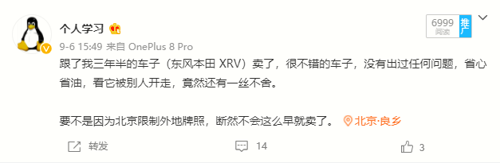

去年 2 月份排到了北京的新能源指标，意味着我今年如论如何都要换车了。

在上个月的时候，换上了新能源汽车，把之前的本田 XRV 卖了，因为不舍，还发了一条微博，纪念一下。

卖了本田 XRV 的当天，我就把新车开回来了，这次买车的经历，远没有第一次买车时的激动，人生的第一次还是弥足珍贵的。

汽车是一笔不小的「负债」，而越是负债，却越能勾起人们的消费欲望，可能是因为这类消费品，能够让人们获得即时满足感，同时获得愉悦。

可是，这可是汽车，不是数码产品，又再强的消费欲望，也会被成本限制因素一下子拉回现实。

### 硬性条件

谈到「成本限制」，就不得不先考虑一下，有哪些硬性条件，做啥事还是现实一点比较好，欲望是没有上线的，还得看看自己的能力。硬性条件有两点：

- 首先预算：25 万以内，基本就排除了 Tesla，蔚来，理想等车子
- 其次车型：纯电动，北京新能源牌照的限制，排除所有混动车型

这么一列，可选范围差不多直接砍掉了三分之一，所以，在你纠结的时候，可以先列一下硬性的限制条件，避免自己在选择的过程中，跑偏方向。

恰好看车这段时间，老爸在京，连续两三个周末，我都跟他一块出去看车子，试驾了比亚迪汉、小鹏 P7，实际体验了比亚迪秦/秦 Pro、荣威 Ei5、荣威 ER6，这几款车子都是 20 万左右。

除了这些，还有北汽的 EU EC 系列，比亚迪的 e 系列以及威马汽车等，这么来看，可选的车型似乎还是有点多。

于是，我大致浏览了一下这些车子的价格，以及车子的属性和类型，还可以进行如下分类：

### 按价格细分

按价位再细分，可分为如下三类：

#### 10 万以内

定位代步车，空间小，续航 300 左右，市内代步，占车牌是其主要的功能。更多面向那种没有汽车需求，或是已经有车子的家庭，但是要占上新能源牌照的这类用户。

代表：比亚迪 e1，或更低价的五菱宏光 MINI EV（据说这是月销量超越过 Tesla 的车型）

#### 10-20 万

主流车型，空间大，续航 400 KM 起步，但是相对传统（外观、功能）。面向对价格比较敏感，但是刚需的用户。

代表就比较多了，由于用户群体庞大，大多数车企几乎都瞄准了这个价位段，上面提到的比亚迪「秦」系列以及「元」系列，北汽、荣威、威马的几乎所有车型，都在这个价位上。

#### 20 万以上

相对高端的车型了，续航 500 KM 起步，外观新颖，功能强大。这个主要面向中产阶级以上的用户了，车子刚需（通勤或），又要有点面子，年轻群体更喜欢。

这个价位的新能源一下就少了，除了新势力小鹏汽车，就是比亚迪的汉，还有荣威的 ER6 高配也到了这个价位。这个价位的车子基础版本，续航都在 500 KM 以上，长续航都达到了 600 KM。

在这个分类下，我跟老爸的分歧就出现了，两代人观念的差异。在老爸的观念里，车子第一要适用，第二要点面子，他更加倾向于选择 10-20 万的车子，在这个价格范围内，典型的几款车型是：

### 按续航细分

#### 300 KM 以内

#### 300 KM 到 400 KM

#### 400 KM 到 500 KM

#### 500 KM 以上

### 按智能化细分

#### 传统

#### 弱智能

#### 智能

### 最终的选择

为什么不买一款主流电动车，例如：比亚迪汉、小鹏，抑或是长续航的，例如：秦、荣威 ER6 等。

对于我来说，主要原因有三点：

1，目前开车需求并不是很高，平均下来，每天 10 公里都不到，主要用途就是遛娃。要是搁在以前通勤使用，又是不一样的选择了。

2，目前新能源汽车才刚刚起步，2020 年对于新能源汽车来说，就像手机时代的 iPhone 4 发布的那年，但还远远还不够成熟，要不是新能源的车牌有效期的问题，我觉得可以再等上两年。

3，上述的那些车子，基本上都看过了，整体来说，对小鹏 P7 的满意度是最高的，试驾之后差点就选它了，冷静下来之后，分析了以上两点，又断然放弃了。多出来的这20 万，做点投资，买点资产，远比买个使用不怎么频繁的消耗品要强多了。

最后，Golf 纯电只是个过渡，为了把新能源的牌了先上了，等时机成熟之后，一定会买个真正意义上的电动车。