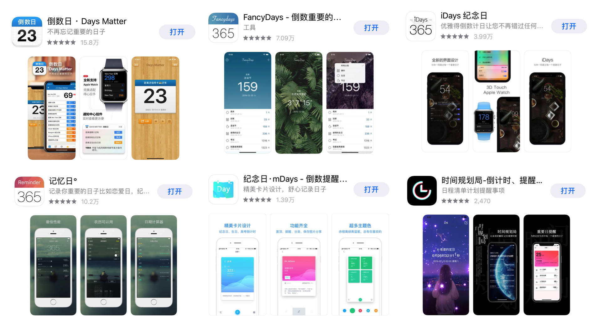
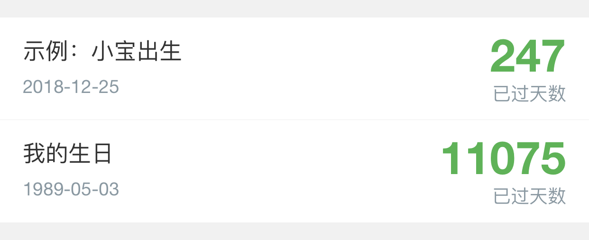
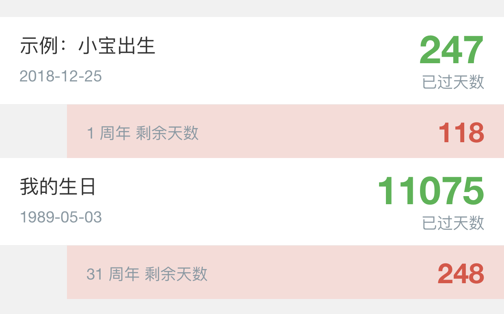
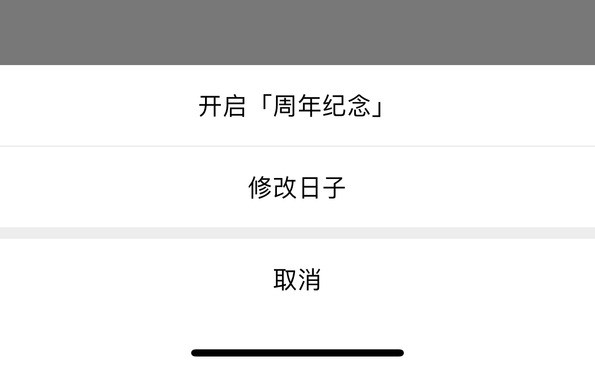

接上篇，说到使用场景。什么场景下，会使用纪念日？或者说，什么日子，需要纪念功能？每周或者每月都要做的事情，需要纪念吗？节假日需要纪念日吗？

在我看来，需要纪念的日子，都是周期较长的非特殊日子。所以，通常都是纪念生日，结婚纪念日等。

如果每周都过的日子，或者是节假日，想必不用纪念，你也都能记住。

### 产品分析
例如纪念生日，其实是想知道，距离下一个生日，还剩下多少天？这里的目标日期是「下一个生日」，而不是某一个固定的日期，目标日期是变化的，也可以说是需要**重复**的。

这就是「Days Matter」在创建日期的时候，就让你选择是否重复的原因。如果选择重复，那么每过一个周期，自动更新目标日期，这样就总能计算出距离下一个目标日期，还剩下多少天；如果选择不重复，那么就是显示距离目标日期，已经过了多少天。

例如，我在添加自己生日的时候，如果选择重复，那么就会显示距离下一个生日还剩下 248 天；如果选择不重复，那么就会显示已经过了 11075 天。

这是很自然就能想到的实现方案，但总觉得很别扭，因为对于**同一个纪念日**，重复或者不重复，是两条不同的信息，需要用户添加两次。

另外，在添加日期的表单中，多了一个叫「重复」的字段，会让用户产生困惑，而增加了使用成本。纪念日就是过去的某一个重要日子，什么是重复不重复。

我认为，应该有更好的解决方案才对。于是，我在 App Store 上搜索「倒数日」，将下载量比较高的 App 都下载了下来，试用了一遍。

试用了将近 10 来款 APP，果不其然，他们的实现逻辑全部都和「Days Matter」一致，那就是，在表单中加入「重复」字段。

连重复这个名称，都懒得改一下，也是醉了。直接使用「纪念周期」都比「重复」要好得多。

### 我的方案
所谓纪念日，就是过去的某个特殊日期，在添加的时候，它并不存在重复不重复的说法。也就是说，在添加日期的表单中，「重复」或者「纪念周期」类似的字段，根本就不需要。

用户也不需要去思考，是否选择重复的问题。用户需要做的是，记下过去那个重要时刻的日期即可。

添加完成后，默认显示过了多少天，当用户需要知道，距离下一个日期还剩下多少天的时候，可以手动开启纪念功能。

把纪念功能放到添加纪念日期之后，而不是用「重复」字段，把一个纪念日，生生割裂成两个日期。

这种处理方式更加符合常识，把选择滞后处理，也提升了用户体验，同时，一个纪念日，就是一条信息，数据逻辑也更清晰。

你可能会说，这是精简了功能的缘故。如果我想要显示，每隔 18 天，35 天，125 天，就重复一次的纪念日，你这咋实现？上面那个方案，我就可以在「重复」字段里，选择 18 天，35 天，125 天进行重复，直接就可以实现了。

我也可以在开启纪念功能的时候，让你选择纪念周期，同样是可以实现的。但是，我首先需要考虑的是，有什么纪念日，需要每隔 18 天 ，或 35 天，或 125 天纪念一下？

还是回到最初说的那句话「功能全未必是好的解决方案」，再加一句「产品的使用场景很重要」。

完。
