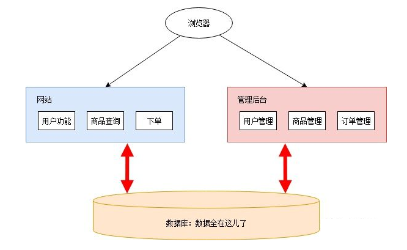
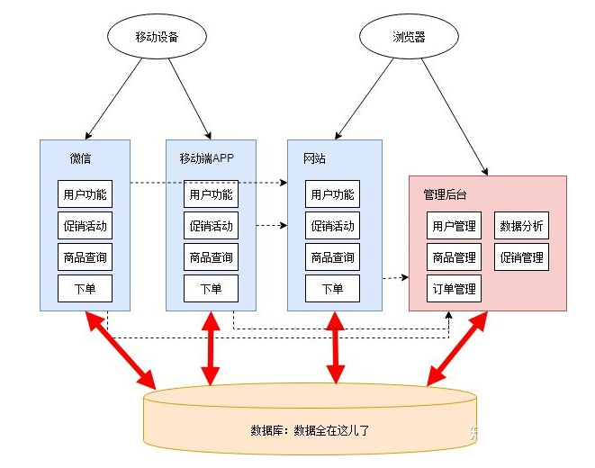
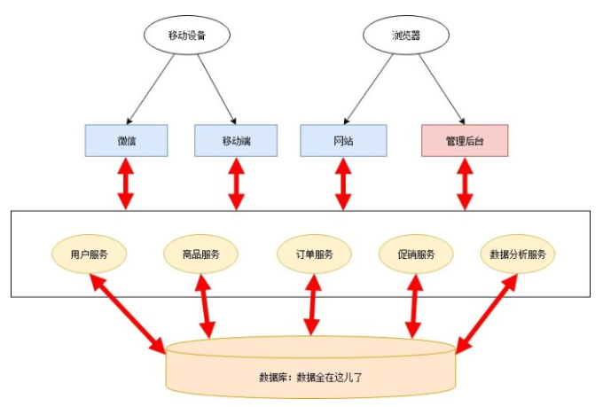
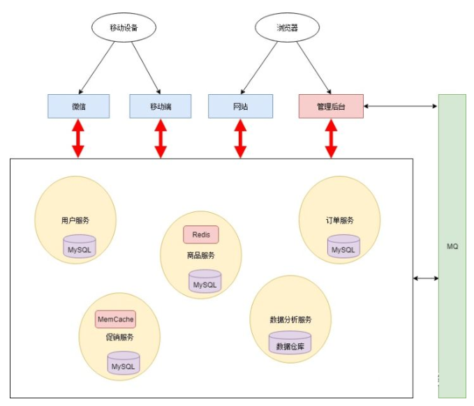
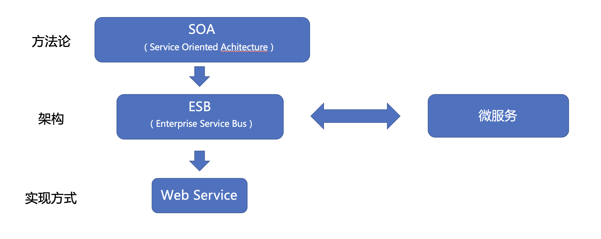

微服务，这其实是一个比较大的概念，就像问什么是「人工智能」，什么是「大数据」，什么是「区块链」一样，似乎很熟悉，但是，好像又说不出什么来。

上次在讨论产品架构的时候，我们谈到了微服务的这个方向，而我在之前公司也接触过一些这方面的工作，一直想要整理一下，所以，借着这个机会，整理出来，分享给大家，耽误大家大概半个多小时的时间，相信一定能有一些收获。

我在整理的过程中，就发现，原来之前我接触的那些工作，实在是冰山一角，微服务涉及到的内容，实在太多了，就像之前同事分享过的「数据挖掘和人工智能」课题一样，听上去很熟悉的一个话题，其实里面的内容很深且广。

### 目录

下面我就从这三个方面来讲一下：

- 第一点，什么是微服务？这里会讲到微服务的发展过程；
- 第二点，讲一下微服务架构到底包含哪些内容，这块是微服务的核心内容；
- 第三点，简单谈一下，咱们的产品接下来可以尝试从哪个方向去做，当然这里只是给个建议，具体技术实现，可能还需要技术团队去研究。

### 什么是微服务

首先来看下，什么是微服务。**每一个技术的发展都是由业务驱动的**，这个大家没有什么异议吧。

正是由于当前技术方案已经不能满足业务需求，我们才会去研究新的技术方案，于是，就会出现一堆新的技术名词。什么负载均衡，什么 `Redis`，什么 `MemCache` 等等。

微服务也就是近几年才诞生的一个新概念，诞生的过程，我希望通过一个简单的故事介绍一下。

> 故事来源：https://www.zhihu.com/question/65502802
> 我会做一些精简，详细故事可去原文查看。

小明和小皮一起创业做网上超市，小明负责程序开发，小皮负责其他，这个「其他」一般是指产品经理。很多时候，一个程序员，一个产品经理就组成了一个创业团队。

最开始的时候，网站的功能很简单，实现业务核心功能，满足用户基本需求，就可以了，所以，第一版产品很快就上线了，它的架构大概如下图所示：

这大概是很多初创团队产品最初的样子，分为前台，后台，数据库。

然而随着业务的发展，出现了各种竞争对手，在竞争的压力下，小皮认为，需要开展一些营销手段了（新的需求产生新的功能）。

除了新增营销的相关功能，还为了精准营销，开发了数据分析模块，同时，也支持了移动端设备，开发了微信小程序以及 APP。

开发任务多了起来，开发人员不够了，于是团队又加了一个人，负责移动端的开发。在这个阶段，产品的架构图大致如下图所示：

可以看出，功能更加的复杂了，而整体架构没有发生太大的变化，依然是分为前台，后台以及数据库。

但是，这种架构会出现很多的问题，例如：

- 代码重复。有很多相同业务逻辑的代码在不同的模块中；
- 应用边界模糊，功能归属混乱。单个应用为了给其他应用提供接口，渐渐地越改越大，包含了很多本来就不属于它的逻辑。
- 功能堆积，出现性能瓶颈。管理后台在加入数据分析和促销管理相关功能后出现性能瓶颈，影响了其他应用；
- 开发、测试、部署、维护愈发困难。即使只改动一个小功能，也需要整个应用一起发布；
- 团队出现推诿扯皮现象。关于一些公用的功能应该建设在哪个应用上的问题常常要争论很久；

团队很快发现，这不是长久之计，需要对产品架构进行改造，开发团队在完成正常业务的开发外，牺牲了大部分的业余时间，对一些通用的功能模块进行抽象封装，最后产品架构图如下：

在这个阶段，引入了服务化的概念，抽象一些通用的功能模块，封装后形成公用服务，供前台调用。

虽然业务服务分开了，但是依然有一些问题，例如：数据库依然公用，对数据库的调用接口依然混乱。

因此，团队一鼓作气，将数据库也拆开了，各个业务模块形成完全独立的服务，并独立部署在独立的容器里。这时的产品架构图如下：

到这里就有了微服务的雏形，现在简单回顾一下，微服务产生的几个发展阶段：

第一阶段：单体应用阶段，最常见的就是 LAMP 架构，对应上面得的故事，就是前两个发展阶段。这一阶段的优点是学习成本低，开发快，可以快速对产品进行试错，但是缺点也很明显。

第二阶段：服务化，抽象出公用的业务逻辑，形成公共服务。从本地方法调用的方式，变成通过接口远程调用。这个阶段，虽然采用了服务化的思路，但是，某种程度来讲，并不彻底。

第三阶段，微服务，随着 Docker 为代表的容器化技术以及敏捷开发测试的文化驱动下，使得服务化思想进一步发展，形成微服务。它与服务化的差别就是：拆分粒度更细，服务独立部署，独立维护，但对服务治理能力要求高。

### 微服务架构

一种技术在解决一个问题的同时，势必会带来另外一些问题。我们是否要采取某个技术方案，通常要看，它所带来的利，是否大于弊。

上面我们已经介绍了微服务的发展，从那个例子中可以看出，最后一个阶段的产品架构似乎很完善，但是，随着微服务数量越来越多，它暴露出来的问题也越来越多。

例如，怎么定义服务？如何解决服务之间调用的问题？出现故障了，如何定位哪个服务出现了问题？又怎么来解决？

好多问题，在单体应用阶段可能不值一谈，而一旦微服务数量达到几十个上百个的时候，很多问题就会被成倍放大，而微服务架构就是要去解决这些问题。

**微服务架构**提出了 6 大组件，分别为：服务描述、注册中心、服务框架、服务监控、服务追踪以及服务治理。

它们就是解决微服务发展过程中的那些问题而诞生。

所以，当我们在谈到微服务架构的时候，就要想到这 6 个组件都描述了哪些内容。

下面将分别来介绍这 6 个组件的基础内容。

#### 服务描述

服务描述要解决的问题有：

- 服务名叫什么？
- 调用这个服务需要提供哪些信息？
- 服务返回的结果是什么格式？
- 如何解析结果？

我们如何定义服务，以及服务之间如何沟通，这是服务描述要解决的问题，常用的方案有三类：

**RESTful API**

它主要应用在 HTTP 或 HTTPS 协议的接口下，在非微服务的架构体系下，也广泛被采用。

这种方案的优点是，服务调用方几乎没有学习成本，适用于跨业务平台之间的调用。例如我们常看到平台提供 URL 供开发者调用，采用的就是这种方式。

**XML 配置**

它主要应用于 RPC 协议的服务。它相对于 RESTful API 会更加的高效，性能比 HTTP 协议要好。

但是，这种方式对业务代码的侵入性比较高，当配置有更新的时候，服务提供方以及服务调用方都要做相应的更新，它更适用内部系统之间的调用。

**IDL（Interface description language）**

这是一种通用方式，常用于 Thrift 和 gRPC 这类跨语言服务调用框架。它通过一种中立的方式来描述接口，实现跨语言平台之间的调用。

这是目前比较热门的一种技术实现方案。

#### 注册中心

这是微服务架构里最核心的组件，它要解决的问题是：

- 如何让外部知道你提供的服务？
- 如何查询所需要调用的服务？

当服务数量达到几十个，甚至上百多个的时候，找服务将是一个比较棘手的问题。

注册中心就是在服务提供方与服务调用方之间，搭起一个桥梁。

打个不恰当的比方，服务描述就是规范了两个人要以哪种语言沟通，那么，注册中心，就是尽快让两人认识。

#### 服务框架

服务框架就涉及到服务之间如何调用的问题了，它要解决的问题是：

- 网络通信采用什么协议？
- 数据传输采用什么方式？
- 数据压缩采用什么格式？

网络通信分为网络连接以及请求方式。网络连接可以是基于 HTTP 协议的，也可以基于 TCP 协议；请求方式有同步，也有异步。

数据传输的协议，有基于标准的 HTTP 协议，也有自定义的一些协议，例如阿里巴巴的 Dubbo 框架就有自己的 Dubbo 协议。

数据压缩主要是为了处理特殊编码以及减少数据传输量，常用方法就是数据序列化。

还拿上面的比喻讲的话，服务框架就是两个人如何相识，是面谈还是网聊？面谈的话，是走地铁还是公交？网聊的话，是语音还是视频？

到这里服务之间就算是对接上了，接下来就是微服务的管理成本了。

#### 服务监控

首先是如何知道服务调用是否正常，什么算是正常，什么算是不正常，这个问题相对单体应用，要复杂得多，因为服务数量多，需要监控的连接数自然也多。

它的工作流程分为 3 步：指标收集、数据处理以及数据展示。

- 指标收集指的是要监控哪些指标，例如：响应时间，错误率等；
- 数据处理指的是如何处理收集的指标数据，是通过接口聚合，还是需要采用数据挖掘，另外，还包括如何存储数据的问题；
- 数据展示通常就是以看板的形式显示，能够一目了然看到所有服务的状态。

#### 服务追踪

监控中发现的问题，是如何快速定位的？采用了什么样的技术实现？这是服务追踪组件要解决的问题。

它的原理其实很简单，就是使用「调用链」的方式。服务调用者发起请求的时候，会带用唯一标识，服务提供者会记录这次请求的唯一标识，并再生成自己的唯一标识，当还需要往下调用的时候，每一次的标识都会一层一层往下传递下去。

当某一个节点出现问题的时候，通过标识符就可以快速定位到问题所在。

#### 服务治理

监控和追踪都是为了找到问题，而如何解决问题，还要看服务治理。

准确的说，这里不单单是指事后解决问题，而更重要的是，通过一系列的手段来保证在各种意外情况下，服务调用仍然能够正常进行。

服务治理针对不用的故障类型，会有一些对应的治理手段。

针对单机故障，也就是某一个服务节点 down 了，采用的治理手段通常是节点摘出，注册中心检测出问题后主动摘出。

另外，针对依赖的服务不可用的情况，会采用熔断（一段时间内停止发起调用，直接返回结果，缓解服务压力）的解决方案。

还有诸如负载均衡以及服务路由的治理手段，这里就不展开说了。

### 产品规划

介绍完了整个微服务架构的内容，看上去这似乎是一个很完善的服务化解决方案，架构里各种组件的功能也很完备，那么，是不是我们都应该要上微服务架构呀？

答案是否定的。前面说过，每一种技术的发展都是由业务驱动的，我们一定要认识到一点，**技术是中立的，适合自己业务才最重要**。

例如，在产品验证阶段，我们一个单体应用就能解决用户痛点，满足用户需求，那么单体应用架构就是最佳的技术方案，随着业务的发展，单体应用带来的弊渐渐大于利，我们就需要考虑其他的技术方案，就像开头故事里讲的那样。

接下来，我们就要去想，我们的业务处在什么阶段，要采用什么样的技术方案？

产品是否要服务化，采用微服务架构，倒是有一些可参考的指标。例如开发人数，当数量超过 10 人，开发之间的协作就变得越来越困难，可以考虑业务拆分。

另外，产品内如果采用了不同的语言开发，例如某一个 C# 开发的数据分析软件，中间的数据处理以及分析功能，使用了机器学习的算法，而算法模块是使用 Python 开发的。

这些都是好的契机，根据业务发展，可以逐步引入服务化的概念。

最后，一定要记住，采用什么样的技术架构，一定是随着当前业务的发展，一步一步演化而来的。

### 附：一些名词解释

入门阶段很容易被一些概念所困惑，这块我也查了一些资料，对一些名词做简单的解释。

- **SOA**（Service Oriented Architecture）：面向服务体系架构，它是服务化的方法论，具有指导意义的。
- **ESB**（Enterprise Service Bus）：企业服务总线，它是一种模式，通过该模式，集中式软件组件可以执行与后端系统的集成（以及数据模型的转换，深度连接，路由和请求），并将这些集成和转换用作服务接口，以供新的人员重用。
- **Web Service**：SOA 的一种实现技术。Web Service 基于两种协议：SOAP 和 REST协议。现在常用的是 REST 协议。

有个比喻感觉挺好，贴过来：

> SOA 是方法论，就像建筑学一样，指导性质的；
> ESB 是建筑图纸，理顺整个建筑的架构；
> Web Service 是具体的建筑材料，就好像预制板；

微服务可以说是 ESB 的进一步细化，是它的升级版，ESB 更多是解决不同平台之间的数据通信问题。

而微服务进一步细化，将单个应用程序的内部再分解为小块，这些小块可独立更改，扩展和管理，随着虚拟化，云计算，敏捷开发实践和 DevOps 的兴起，微服务应运而生。

参考文档：

- [SOA,ESB,WebService的关系-IT·Ren](http://itren.xiaolee.net/p/2314815.html)
- [Web 服务编程，REST 与 SOAP](https://www.ibm.com/developerworks/cn/webservices/0907_rest_soap/index.html)
- [什么是微服务架构？ - 知乎](https://www.zhihu.com/question/65502802)
- [What is SOA (Service-Oriented Architecture)? | IBM](https://www.ibm.com/cloud/learn/soa)
- [What is an ESB (Enterprise Service Bus)? | IBM](https://www.ibm.com/cloud/learn/esb)
- [What are Microservices? | IBM](https://www.ibm.com/cloud/learn/microservices)

---

关于微服务架构的内容，我整理了一个超级脑图，在**公众号上回复「微服务架构」**，你将获得我整理后的完整资料。